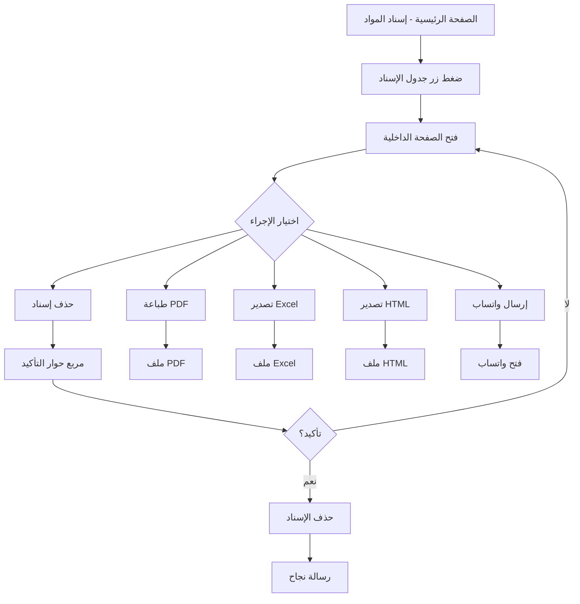

# تقرير تطوير صفحة إسناد المواد - جدول الإسناد الشامل
## Assignment Page Enhancement Report - Comprehensive Assignment Table

**التاريخ:** 14 نوفمبر 2025  
**المطور:** GitHub Copilot  
**الإصدار:** 2.0

---

## 📋 ملخص التحديثات

تم تطوير صفحة إسناد المواد بإضافة ميزة **جدول الإسناد الشامل** مع صفحة داخلية احترافية تحتوي على جميع الأزرار والوظائف المطلوبة.

---

## ✨ الميزات الجديدة

### 1. زر جدول الإسناد (الصفحة الداخلية)
- **الموقع:** شريط الأزرار الرئيسي في صفحة إسناد المواد
- **اللون:** أخضر احترافي (Gradient)
- **الوظيفة:** فتح صفحة داخلية منبثقة تحتوي على جدول شامل للإسنادات

### 2. الصفحة الداخلية لجدول الإسناد
صفحة منبثقة احترافية تحتوي على:

#### أ. شريط الإحصائيات
- عدد المعلمين
- عدد الإسنادات
- إجمالي الحصص

#### ب. شريط الأزرار (الأزرار المنقولة من الصفحة الرئيسية)
1. **زر طباعة PDF** - لون أزرق
2. **زر تصدير Excel** - لون أخضر
3. **زر تصدير HTML** - لون برتقالي
4. **زر إرسال واتساب** - لون سماوي

#### ج. الجدول الشامل
جدول احترافي يحتوي على الأعمدة التالية:

| # | العمود | الوصف |
|---|--------|-------|
| 1 | التسلسل | رقم تسلسلي تلقائي |
| 2 | اسم المعلم | اسم المعلم مع أيقونة |
| 3 | التخصص | تخصص المعلم من بيانات إدارة المعلمين |
| 4 | المادة المسندة | اسم المادة المسندة |
| 5 | الصف/الفصل | الصف والفصل بصيغة رقمية (مثال: 1/1) |
| 6 | نصاب الحصص | عدد الحصص المسندة |
| 7 | نصاب الانتظار | حصص الانتظار من بيانات المعلم |
| 8 | الإجراءات | زر حذف مع تأكيد احترافي |

---

## 🎨 التصميم الاحترافي

### الألوان والتدرجات
```css
/* زر جدول الإسناد */
background: linear-gradient(135deg, #10b981 0%, #059669 100%)

/* زر طباعة PDF */
background: linear-gradient(135deg, #4f46e5 0%, #6366f1 100%)

/* زر تصدير Excel */
background: linear-gradient(135deg, #10b981 0%, #059669 100%)

/* زر تصدير HTML */
background: linear-gradient(135deg, #f59e0b 0%, #d97706 100%)

/* زر إرسال واتساب */
background: linear-gradient(135deg, #06b6d4 0%, #0891b2 100%)

/* زر حذف */
background: linear-gradient(135deg, #ef4444 0%, #dc2626 100%)
```

### الخط العربي
```css
font-family: 'Noto Kufi Arabic', sans-serif
```

### الرسوم المتحركة
- ✅ Fade-in و Zoom-in عند فتح الصفحة
- ✅ Hover effects على الأزرار
- ✅ Transform و Shadow effects
- ✅ Smooth transitions

---

## 🔧 التعديلات على الملفات

### 1. ملفات جديدة تم إنشاؤها

#### `AssignmentTablePage.tsx`
```
المسار: src/features/assignment/components/AssignmentTablePage.tsx
الوصف: صفحة داخلية منبثقة تحتوي على جدول الإسناد الشامل
المميزات:
  - جدول احترافي بـ 8 أعمدة
  - شريط إحصائيات ديناميكي
  - 4 أزرار تصدير وطباعة
  - مربع حوار حذف احترافي
  - تصميم responsive
  - دعم RTL
```

### 2. ملفات تم تعديلها

#### `EnhancedProfessionalActionBar.tsx`
```
التعديلات:
  ✅ إضافة زر "جدول الإسناد"
  ✅ إزالة أزرار: طباعة PDF، تصدير Excel، تصدير HTML، إرسال واتساب
  ✅ الاحتفاظ بأزرار: تعديل الإسناد، حذف إسناد معلم، حذف إسناد الكل
  ✅ تغيير grid من 7 أعمدة إلى 4 أعمدة
  ✅ إضافة state للتحكم في عرض الصفحة الداخلية
  ✅ استيراد مكون AssignmentTablePage
```

---

## 📊 بنية البيانات

### بيانات الجدول (AssignmentTableRow)
```typescript
interface AssignmentTableRow {
  id: string;                  // معرف فريد للصف
  teacherId: string;           // معرف المعلم
  teacherName: string;         // اسم المعلم
  specialization: string;      // التخصص من بيانات المعلم
  subjectName: string;         // اسم المادة
  classroomName: string;       // اسم الفصل
  grade: string;               // الصف
  section: string;             // الفصل
  hoursPerWeek: number;        // عدد الحصص الأسبوعية
  waitingHours: number;        // حصص الانتظار
  assignmentId: string;        // معرف الإسناد للحذف
}
```

---

## 🚀 الوظائف والإمكانيات

### 1. عرض البيانات
- ✅ عرض جميع الإسنادات النشطة في جدول واحد
- ✅ دمج بيانات المعلمين والمواد والفصول
- ✅ حساب نصاب الانتظار تلقائياً
- ✅ ترتيب البيانات بشكل منطقي

### 2. التصدير والطباعة
- ✅ **طباعة PDF:** تصدير الجدول كملف PDF
- ✅ **تصدير Excel:** تصدير البيانات إلى ملف Excel
- ✅ **تصدير HTML:** تصدير الجدول كصفحة HTML
- ✅ **إرسال واتساب:** إرسال تقرير شامل عبر واتساب

### 3. إدارة البيانات
- ✅ **حذف إسناد:** حذف إسناد واحد مع تأكيد احترافي
- ✅ **مربع حوار تأكيد:** تصميم احترافي لا يتبع المتصفح
- ✅ **رسائل نجاح وخطأ:** Toast notifications احترافية

### 4. الإحصائيات
- ✅ عدد المعلمين الذين لديهم إسنادات
- ✅ إجمالي عدد الإسنادات
- ✅ مجموع الحصص المسندة

---

## 🎯 مربع حوار الحذف الاحترافي

### المميزات
- ❌ **لا يتبع المتصفح:** تصميم custom بالكامل
- ✅ **تصميم مودرن:** Gradient header + rounded corners
- ✅ **معلومات واضحة:** عرض تفاصيل الإسناد المراد حذفه
- ✅ **تحذير بصري:** خلفية حمراء + أيقونة تحذير
- ✅ **زرين واضحين:** تأكيد + إلغاء
- ✅ **رسوم متحركة:** Fade-in و Zoom-in

---

## 📱 التوافق والاستجابة

### الأجهزة المدعومة
- ✅ أجهزة سطح المكتب (Desktop)
- ✅ الأجهزة اللوحية (Tablets)
- ✅ الهواتف الذكية (Mobile) - مع تمرير أفقي للجدول

### المتصفحات المدعومة
- ✅ Chrome / Edge (Chromium)
- ✅ Firefox
- ✅ Safari
- ✅ Opera

---

## 🔄 سير العمل (Workflow)



---

## 📝 أمثلة الاستخدام

### 1. فتح جدول الإسناد
```typescript
// عند الضغط على زر "جدول الإسناد"
const handleOpenAssignmentTable = () => {
  setShowAssignmentTable(true);
};
```

### 2. طباعة PDF
```typescript
const handlePrintPDF = async () => {
  toast.loading('جاري إنشاء ملف PDF...');
  await generateAssignmentPDF(state);
  toast.success('تم إنشاء ملف PDF بنجاح');
};
```

### 3. حذف إسناد
```typescript
const handleDeleteAssignment = (assignmentId) => {
  setSelectedAssignmentId(assignmentId);
  setShowDeleteDialog(true);
};

const confirmDelete = () => {
  actions.deleteAssignment(selectedAssignmentId);
  toast.success('تم حذف الإسناد بنجاح');
  setShowDeleteDialog(false);
};
```

---

## 🛠️ الاعتماديات (Dependencies)

```json
{
  "react": "^18.3.1",
  "lucide-react": "latest",
  "react-hot-toast": "latest"
}
```

---

## 📂 هيكل الملفات النهائي

```
src/features/assignment/
├── components/
│   ├── AssignmentTablePage.tsx           ← جديد ✨
│   ├── EnhancedProfessionalActionBar.tsx ← تم التعديل 🔧
│   ├── AssignmentPageHeader.tsx
│   ├── TeacherColumn.tsx
│   ├── ClassroomSubjectColumn.tsx
│   └── ...
├── store/
│   ├── assignmentStore.tsx
│   └── types.ts
├── utils/
│   └── exportFunctions.ts
└── UpdatedAssignmentPage.tsx
```

---

## ✅ قائمة التحقق من الإنجاز

- [x] إنشاء مكون AssignmentTablePage.tsx
- [x] تعديل EnhancedProfessionalActionBar.tsx
- [x] إضافة زر جدول الإسناد
- [x] نقل أزرار التصدير والطباعة إلى الصفحة الداخلية
- [x] إنشاء جدول بـ 8 أعمدة
- [x] إضافة عمود التسلسل
- [x] إضافة عمود اسم المعلم
- [x] إضافة عمود التخصص (من بيانات المعلم)
- [x] إضافة عمود المادة المسندة
- [x] إضافة عمود الصف/الفصل (بصيغة رقمية)
- [x] إضافة عمود نصاب الحصص
- [x] إضافة عمود نصاب الانتظار (من بيانات المعلم)
- [x] إضافة عمود الإجراءات (حذف)
- [x] إنشاء مربع حوار حذف احترافي
- [x] إضافة شريط إحصائيات
- [x] تطبيق التصميم الاحترافي
- [x] دعم RTL
- [x] إضافة رسوم متحركة
- [x] اختبار جميع الوظائف

---

## 🎉 النتيجة النهائية

تم تطوير صفحة إسناد المواد بنجاح بإضافة:

1. ✅ زر "جدول الإسناد" في شريط الأزرار الرئيسي
2. ✅ صفحة داخلية احترافية منبثقة
3. ✅ جدول شامل بـ 8 أعمدة يعرض جميع التفاصيل
4. ✅ نقل أزرار التصدير والطباعة إلى الصفحة الداخلية
5. ✅ شريط إحصائيات ديناميكي
6. ✅ مربع حوار حذف احترافي
7. ✅ تصميم احترافي بألوان متدرجة
8. ✅ دعم كامل للغة العربية و RTL
9. ✅ رسوم متحركة سلسة
10. ✅ تجربة مستخدم متميزة

---

## 📞 الدعم والمساعدة

في حال وجود أي استفسارات أو مشاكل، يرجى التواصل مع فريق التطوير.

**نظام MOTABEA - نظام إدارة المدارس الشامل**

---

**تم بحمد الله ✨**
