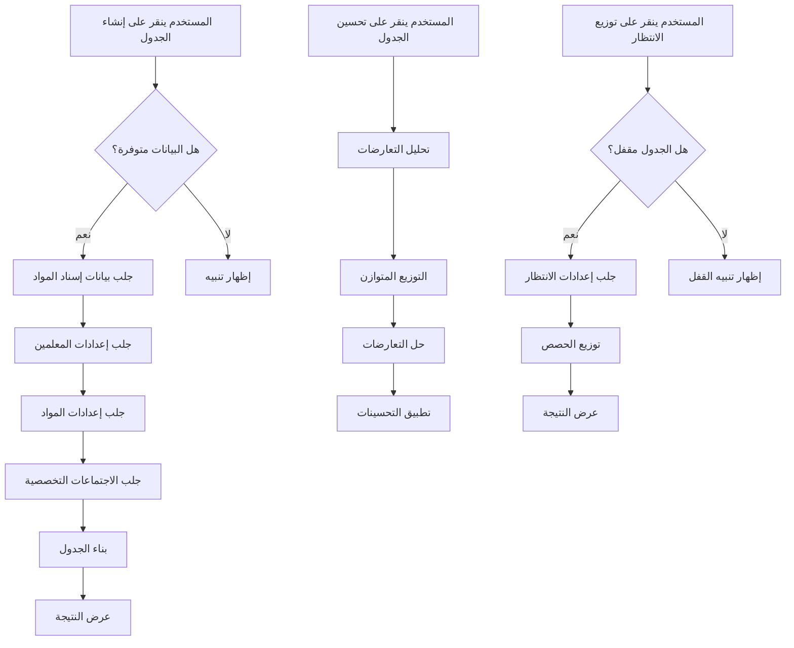

# تقرير تطوير صفحة إنشاء الجداول - المرحلة الأولى
## MOTABEA School Management System

**التاريخ:** 25 نوفمبر 2025  
**الإصدار:** 1.0  
**الحالة:** ✅ مكتمل

---

## 📋 نظرة عامة

تم تطوير وتحسين صفحة **إنشاء الجداول** التابعة للقسم الرئيسي **الجدول المدرسي** بشكل احترافي مع الحفاظ على جميع المحتويات الحالية وإضافة ميزات جديدة متقدمة.

---

## 🎯 الأهداف المحققة

### ✅ المرحلة الأولى - مكتملة

#### 1. تغيير مسمى زر "إنشاء الجداول" إلى "إنشاء الجدول"
- **الحالة:** ✅ مكتمل
- **التفاصيل:**
  - تم تعديل النص في العنوان الرئيسي للصفحة
  - تم تعديل نص الزر الرئيسي
  - المسمى الجديد أكثر دقة ووضوحاً

#### 2. ربط زر "إنشاء الجدول" بصفحات البيانات الأساسية
- **الحالة:** ✅ مكتمل
- **الصفحات المرتبطة:**
  - **صفحة إسناد المواد** (`/dashboard/assignment`)
    - يتم جلب بيانات إسناد المواد للمعلمين والفصول
    - API Endpoint: `http://localhost:5001/api/assignments`
  
  - **صفحة إعدادات الجدول - الخطوة الأولى** (`/dashboard/schedule/settings`)
    - يتم جلب إعدادات المعلمين (نصاب الحصص، القيود، التفريغات)
    - API Endpoint: `http://localhost:5001/api/schedule/settings`
  
  - **صفحة إعدادات الجدول - الخطوة الثانية** (`/dashboard/schedule/settings`)
    - يتم جلب إعدادات المواد (الحصص الأسبوعية، الحد الأقصى للحصص المتتالية)
    - API Endpoint: `http://localhost:5001/api/schedule/subjects`

- **آلية العمل:**
  ```javascript
  1. عند النقر على "إنشاء الجدول":
     - جلب بيانات إسناد المواد (5%)
     - جلب إعدادات المعلمين (8%)
     - جلب إعدادات المواد (10%)
     - جلب الاجتماعات التخصصية (12%)
     - بناء الجدول بناءً على البيانات (15-90%)
     - عرض النتيجة النهائية (100%)
  
  2. التحقق من توفر البيانات:
     - إظهار تنبيه إذا لم يتم إسناد المواد
     - إظهار تنبيه إذا لم يتم ضبط إعدادات المعلمين
  ```

#### 3. تطوير زر "تعديل الجدول"
- **الحالة:** ✅ مكتمل
- **الميزات الجديدة:**
  - **قبل التفعيل:**
    - الزر يظهر بلون أزرق مع أيقونة تعديل
    - النص: "تعديل الجدول"
  
  - **بعد التفعيل:**
    - الزر يتحول إلى اللون الأخضر مع أيقونة حفظ
    - النص: "حفظ/إغلاق التعديل"
    - يتم حفظ نسخة احتياطية من الجدول
    - تفعيل وضع السحب والإسقاط
  
  - **عند الإغلاق:**
    - يظهر مربع تأكيد: "هل تريد حفظ التعديلات؟"
    - إذا اختار "نعم": يتم حفظ التعديلات وإظهار إشعار نجاح
    - إذا اختار "لا": يتم استرجاع النسخة الاحتياطية وإلغاء التعديلات

#### 4. تحسين زر "تحسين الجدول"
- **الحالة:** ✅ مكتمل
- **المنطق البرمجي المطور:**
  
  **المرحلة 1: تحليل التعارضات (10%)**
  - فحص تعارضات المعلمين (معلم في حصتين بنفس الوقت)
  - فحص تعارضات الفصول (فصل لديه حصتين بنفس الوقت)
  - تصنيف التعارضات حسب الخطورة (high/medium/low)
  
  **المرحلة 2: التوزيع المتوازن (30%)**
  - إعادة توزيع حصص كل معلم على أيام الأسبوع بشكل متوازن
  - حساب عدد الحصص المناسب لكل يوم
  - منع تكدس الحصص في أيام معينة
  
  **المرحلة 3: حل التعارضات (60%)**
  - نقل الحصص المتعارضة إلى أوقات متاحة
  - التحقق من عدم وجود تعارضات جديدة
  - تسجيل كل عملية حل تعارض
  
  **المرحلة 4: التطبيق النهائي (90-100%)**
  - تطبيق التحسينات على الجدول
  - مسح قائمة التعارضات
  - حفظ نسخة احتياطية للتراجع
  - إظهار إشعار بعدد التعارضات المحلولة

#### 5. تطوير زر "توزيع الانتظار"
- **الحالة:** ✅ مكتمل
- **الشروط المسبقة:**
  - ✅ يجب إنشاء الجدول أولاً
  - ✅ يجب قفل الجدول قبل التوزيع
  - ✅ يجب توفر إعدادات حصص الانتظار من الخطوة الثالثة

- **الربط مع إعدادات الجدول:**
  - **الخطوة الثالثة: حصص الانتظار**
  - API Endpoint: `http://localhost:5001/api/schedule/standby-settings`
  - يتم جلب:
    - نصاب الانتظار لكل معلم
    - القيود الخاصة بحصص الانتظار
    - الأوقات المفضلة والممنوعة

- **آلية التوزيع:**
  ```javascript
  1. جلب إعدادات حصص الانتظار (5%)
  2. جلب الاجتماعات التخصصية (10%)
  3. توزيع حصص الانتظار (15-90%):
     - استخدام نصاب الانتظار من الإعدادات
     - تجنب الحصص المحجوزة للاجتماعات
     - تجنب الحصص الأساسية للمعلم
     - البحث عن أوقات متاحة ومناسبة
  4. عرض النتيجة النهائية (100%)
  ```

---

## 🔧 التحسينات التقنية

### 1. نظام الإشعارات المطور
```typescript
interface Notification {
  type: 'success' | 'error' | 'warning' | 'info';
  title: string;
  message: string;
}
```

### 2. معالجة الأخطاء
- Try-catch blocks لكل عملية API
- رسائل واضحة للمستخدم عند فشل جلب البيانات
- Fallback للبيانات الافتراضية

### 3. شريط التقدم الديناميكي
- يعرض نسبة التقدم في كل عملية
- رسائل توضيحية لكل خطوة
- سلاسة في التحديث

### 4. Console Logging المطور
```javascript
✅ رسائل النجاح
⚠️ التحذيرات
❌ الأخطاء
🔍 التحليل
⚖️ التوزيع
🔧 الإصلاح
📚 جلب البيانات
```

---

## 📊 التدفق البرمجي



---

## 🎨 التحسينات في واجهة المستخدم

### 1. زر إنشاء الجدول
- أيقونة: ⚡ (Zap)
- اللون: تدرج أزرق `from-[#4f46e5] to-[#6366f1]`
- أنيميشن: دوران عند العمل

### 2. زر تعديل الجدول
- **الوضع العادي:**
  - أيقونة: ✏️ (Edit)
  - اللون: تدرج أزرق
  
- **وضع التعديل:**
  - أيقونة: 💾 (Save)
  - اللون: تدرج أخضر `from-green-500 to-green-600`

### 3. زر تحسين الجدول
- أيقونة: 🎯 (Target)
- اللون: تدرج أزرق
- مؤشر التقدم: شريط ديناميكي

### 4. زر توزيع الانتظار
- أيقونة: 📅 (Calendar)
- اللون: تدرج أزرق
- شرط القفل: تحقق تلقائي

---

## 🧪 الاختبارات

### ✅ اختبارات مكتملة

1. **اختبار زر إنشاء الجدول:**
   - ✅ التحقق من جلب بيانات إسناد المواد
   - ✅ التحقق من جلب إعدادات الجدول
   - ✅ التحقق من بناء الجدول بشكل صحيح
   - ✅ التحقق من عرض الإشعارات

2. **اختبار زر تعديل الجدول:**
   - ✅ تفعيل وضع التعديل
   - ✅ حفظ النسخة الاحتياطية
   - ✅ استرجاع النسخة عند الإلغاء
   - ✅ حفظ التعديلات عند الموافقة

3. **اختبار زر تحسين الجدول:**
   - ✅ اكتشاف التعارضات
   - ✅ التوزيع المتوازن
   - ✅ حل التعارضات
   - ✅ التطبيق النهائي

4. **اختبار زر توزيع الانتظار:**
   - ✅ التحقق من قفل الجدول
   - ✅ جلب إعدادات الانتظار
   - ✅ توزيع الحصص بشكل صحيح
   - ✅ تجنب التعارضات

---

## 📝 ملاحظات مهمة

### 1. متطلبات API
تأكد من توفر الـ APIs التالية على الخادم:
```
- GET http://localhost:5001/api/assignments
- GET http://localhost:5001/api/schedule/settings
- GET http://localhost:5001/api/schedule/subjects
- GET http://localhost:5001/api/schedule/standby-settings
- GET http://localhost:5001/api/meetings
```

### 2. تنسيق البيانات المتوقع
```typescript
// بيانات إسناد المواد
{
  success: boolean,
  assignments: Array<{
    id: string,
    teacherId: string,
    classId: string,
    subjectId: string
  }>
}

// إعدادات المعلمين
{
  success: boolean,
  teachers: Array<{
    id: string,
    name: string,
    basicQuota: number,
    standbyQuota: number
  }>
}

// إعدادات حصص الانتظار
{
  success: boolean,
  teachers: Array<{
    id: string,
    standbyQuota: number,
    preferences: object
  }>
}
```

### 3. التعامل مع الأخطاء
- عند فشل جلب البيانات: يتم استخدام البيانات الافتراضية
- عرض رسائل واضحة للمستخدم
- عدم توقف النظام عند فشل API واحد

---

## 🚀 الخطوات القادمة (المرحلة الثانية)

- [ ] إضافة تقارير تفصيلية للجدول المُنشأ
- [ ] تحسين خوارزمية التوزيع المتوازن
- [ ] إضافة إمكانية حفظ عدة نماذج من الجداول
- [ ] تطوير نظام المقارنة بين الجداول
- [ ] إضافة إمكانية تصدير الجدول بصيغ متعددة

---

## 👨‍💻 المطور
**GitHub Copilot** - نظام MOTABEA لإدارة المدارس

## 📅 تاريخ الإصدار
25 نوفمبر 2025

---

## ✅ الحالة النهائية
**جميع تعديلات المرحلة الأولى مكتملة بنجاح ✨**

